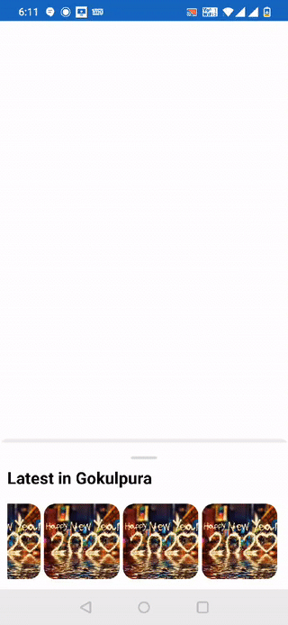

# react-native-bottomsheet-utrain

Cross platform scrollable bottom sheet for both Android and iOS. That integrates with all core scrollable components from React Native.
* Light weight component
* Customize whatever you like
* Smooth animation
* Support drag down gesture

| |
| :--------------------:|

## Installation

Open a Terminal in the project root and run:

```sh
yarn add react-native-bottomsheet-utrain
```

or if you use `npm`:

```sh
npm install react-native-bottomsheet-utrain
```

Install and link [react-native-gesture-handler](https://kmagiera.github.io/react-native-gesture-handler/docs/getting-started.html) and [react-native-reanimated](https://github.com/kmagiera/react-native-reanimated).

## Usage

```javascript
import { Dimensions, Platform } from 'react-native'
import BottomSheet from 'react-native-bottomsheet-utrain';
const refBottom = React.useRef();
const HEIGHT = Dimensions.get('screen').height;
const snapPoints = [50, HEIGHT / 2, '70%', '100%'];

class Example extends React.Component {
  render() {
    return (
      <View style={{flex: 1}}>
      <BottomSheet
       ref={refBottom}
          borderRadius={10}
          bottomSheerColor="#FFFFFF"
          ref="BottomSheet"
          snapPoints={snapPoints}
          enabledGestureInteraction={true}
          enabledContentGestureInteraction={true}
          enabledContentTapInteraction={true}
          enabledInnerScrolling={true}
          renderHeader={
            <View>
              <Text style={styles.text}>Header View</Text>
            </View>
          }
          renderContent={
            <View style={styles.body}>
              <Text style={styles.text}>Body View</Text>
            </View>
          }
        />
      </View>
    );
  }
}
```

## Props

| name                         | required | default   | description                                                                                                                                                                                                                                                                    |
| ---------------------------- | -------- | --------- | ------------------------------------------------------------------------------------------------------------------------------------------------------------------------------------------------------------------------------------------------------------------------------ |
| snapPoints                   | yes      |           | E.g. `[100, 300, 0]`. Points for snapping of bottom sheet coomponent. They define distance from bottom of the screen. Might be number or percent (as string e.g. `'20%'`) for points or percents of screen height from bottom. Note: Array values must be in descending order. |
| initialPosition              | no       | 0         | Determines initial position point of bottom sheet. The value outside of snap points.                                                                                                                                                                                           |
| renderContent                         | no       |           | Method for rendering scrollable content of bottom sheet.                                                                                                                                                                                                                       |
| renderHeader                       | no       |           | Method for rendering scrollable header of bottom sheet.                                                                                                                                                                                                                    |
| headerPosition                   | no       | `number`   | Reanimated node which holds position of bottom sheet's header (in dp)                                                                                                                                                                                                                                     |
| contentPosition     | no       | `number`   | Reanimated node which holds position of bottom sheet;s content (in dp).                                                                                                                                                                                                           |
| onOpenStart              | no       | () => null        | Function to execute when the panel is opened
| onCloseStart              | no       | () => null        | Function to execute when the panel is closed
| enabledGestureInteraction              | no       | false        | Defines if bottom sheet could be scrollable by gesture. Defaults to true.

## Contributors ✨

Thanks goes to these wonderful people:

<!-- ALL-CONTRIBUTORS-LIST:START - Do not remove or modify this section -->
<!-- prettier-ignore -->
<table>
  <tr>
    <td align="center"><a href="https://github.com/utrainco"><br /><sub><b>Utrainco</b></sub></a><br /><a href="#infra-Numan" title="Infrastructure (Hosting, Build-Tools, etc)">🚇</a> <a href="https://github.com/utrainco" title="Code">💻</a></td>
  </tr>
</table>

<!-- ALL-CONTRIBUTORS-LIST:END -->
